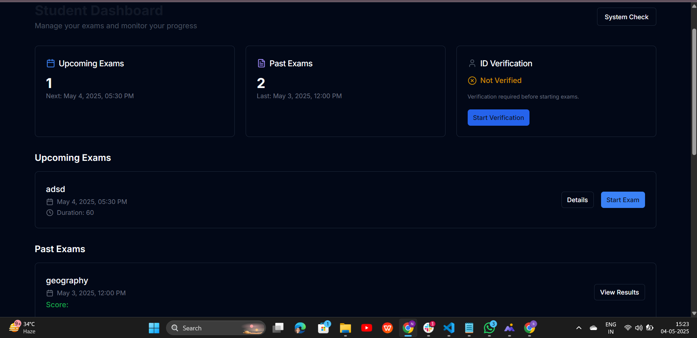

# 🧠 Exam Tutor – Full Stack Application

A full-stack exam management system built with:

- **Backend:** Node.js, Express, MongoDB
- **Frontend:** TypeScript + Vite (No React)
- **Authentication:** JWT
- **Styling:** Tailwind CSS

---

## 📁 Project Structure

```
.
├── backend         # Express + MongoDB API
├── frontend        # Vite + TypeScript (no React)
```

---

## ⚙️ Backend Setup (`/backend`)

### 1. Navigate to the backend folder:

```bash
cd backend
```

### 2. Install dependencies:

```bash
npm install
```

### 3. Create a `.env` file in `/backend`:

```env
PORT=5000
MONGO_URI=mongodb://localhost:27017/Examtutor
JWT_SECRET=your_secret_key
```

### 4. Start the server:

```bash
npm run dev
```

The backend API will run at: `http://localhost:5000`

---

## 🌐 Frontend Setup (`/frontend`)

### 1. Navigate to the frontend folder:

```bash
cd frontend
```

### 2. Install dependencies:

```bash
npm install
```

### 3. Create a `.env` file in `/frontend`:

```env
VITE_API_BASE_URL=http://localhost:5000
```

### 4. Start the frontend server:

```bash
npm run dev
```

Visit the app at: `http://localhost:5173`

---

## 📸 Profile Picture Handling

Uploaded profile pictures are stored at:

```
/backend/uploads/profile-pics
```

They are served statically through Express and displayed using:

```ts
${VITE_API_BASE_URL}/uploads/profile-pics/filename.jpg
```

---

## 📦 Features

- ✅ User authentication (Student/Admin)
- ✅ Exam creation and listing
- ✅ Profile picture uploads
- ✅ Protected routes
- ✅ Dark/light mode toggle

---

## 🧪 Tech Stack

### Backend:

- Node.js
- Express.js
- MongoDB (Mongoose)
- Multer (for file uploads)
- JWT (Authentication)

### Frontend:

- TypeScript
- Vite
- Tailwind CSS
- Vanilla JavaScript (no frameworks)

---

## 📸 Screens & Comparisons

### 🔹 Home Screen – Initial View


 


### 🔹Role-based... Login/Register...


---
### 🔹 Students/Dashboard




---

### 🔹 Id Verication/Mentor Dashboard


---

### 🔹 Create Exam By Mentor


---

### 🔹 Pop-up / Modal / Notification State


---
